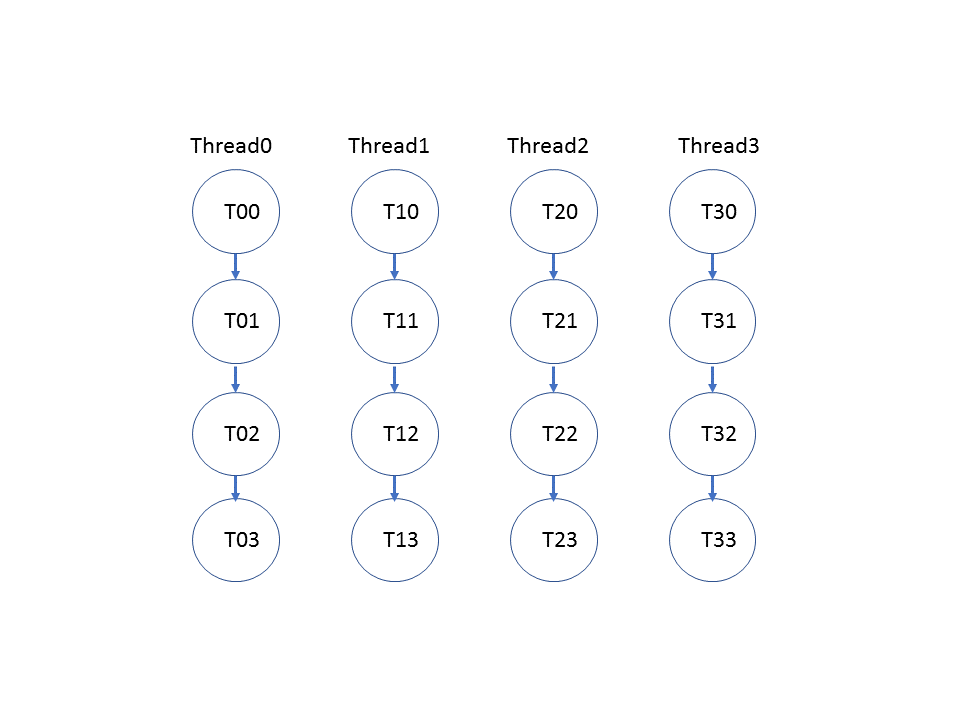
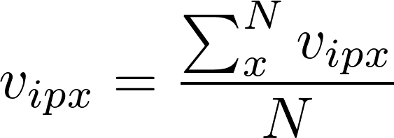
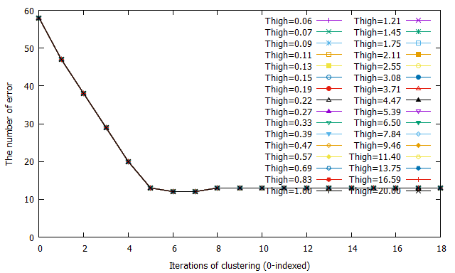
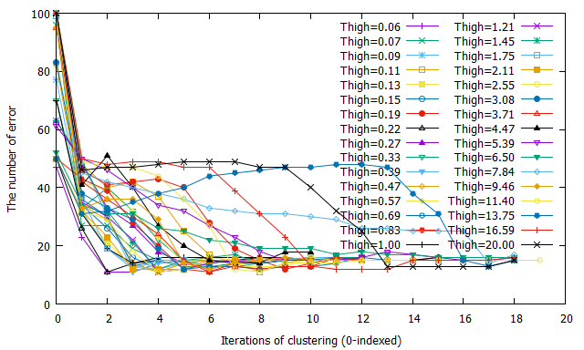
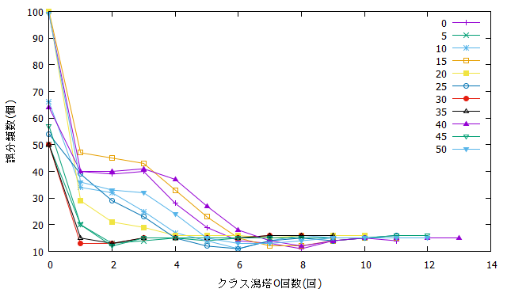
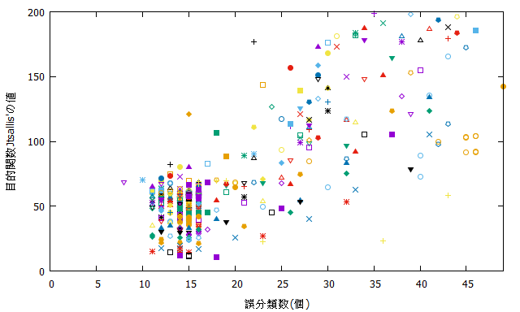
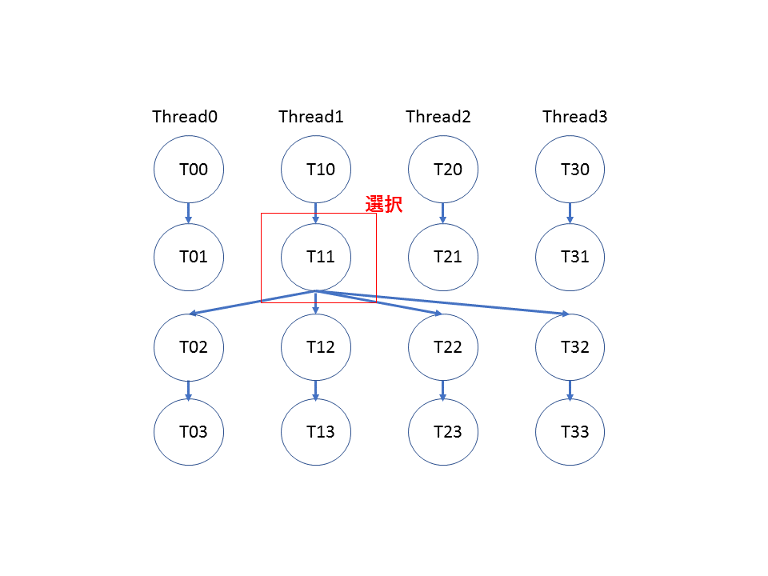
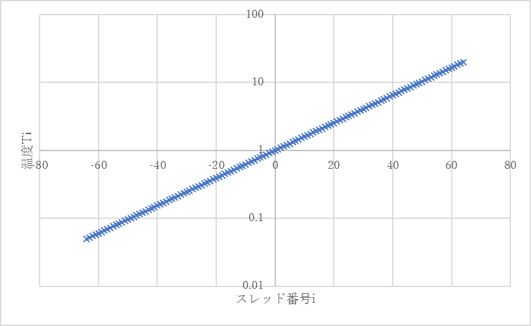

# Pararell FCM

## 異なる初期温度を各スレッドに割り当てる方法

### 基本方針
通常のFCMを複数のスレッドで初期温度を変えて並列に実行する。



考察および問題点
* 各スレッドが独立して動いているのでCPUで動かした場合と変わらない。

### 提案手法[要検討]
各スレッド間で状態の交換を行う。
<font color="pink">交換できるのはTだけじゃない。</font>
* 各スレッドが持っているもの(交換できるもの)
    * <font color="pink">vi</font>(次回uikはviから算出される)
    * 前回のvi
    * 前回の温度でのvi
    * 温度遷移配列
    * 分類結果
    * q値(固定)
    * クラスタリング回数
    * 収束したかどうか
* 交換する条件
    * 評価関数(目的関数Jtsallis'を利用する？)
    * クラスタリング失敗(どう判断するかが課題)
    * クラスタリング終了(終了するのは大体8ループ以降で、交換する価値が低いかも)

### 予備実験

#### viの平均値で置き換える方法
帰属度uikの計算前に、各スレッドごとに割り当てているviの平均値を計算し、
全てのスレッドのviをここで求めた平均値に置き換える。
クラスタ番号i、次元p、スレッド番号xとすると、新しく与えられる
vipxは次の式で求められる。ただし、スレッド数をNとする。


<!--
v_{ipx} = \frac{\sum_x^N{v_{ipx}}}{N}
-->

クラスタリング回数0回目から平均値で置き換える方法を利用し、
クラスタリングを行った結果を図に示す。
この方法を用いてviの移動量による収束判定はできないため、
クラスタリング回数の上限20回で打ち止めにしてある。



置き換えなしの場合は次のようになる。




<!--
before
1. 温度を初期温度に設定
2. クラスタ中心viをランダムに与える
3. 帰属度uikを計算する
4. クラスタ中心viを計算する
5. 同一温度で収束判定し、NOなら3へ
6. 前温度で収束判定し、NOなら温度を更新し3へ
7. 終了

after
1. 温度を初期温度に設定
2. クラスタ中心viをランダムに与える
3. <b>vi <- average(vi)</b>
3. 帰属度uikを計算する
4. <b>分類結果resultsを計算する</b>
4. クラスタ中心viを計算する
5. <b>クラスタリング回数のカウンターcntを1増やす</b>
5. 同一温度で収束判定し、NOなら3へ
6. 前温度で収束判定し、NOなら温度を更新し3へ
7. 終了

-->

<!--
チラウラ 02.21
交換するものをviだけとする
viの平均値を使う？ → ちょっとやってみたい
-->


<!--
この方法を用いてクラスタリングを行い、
* 各スレッドごとの温度と誤分類数の遷移から初期温度の影響を調べる。
* Jtsallis'と誤分類数の相関からJtsallis'が評価関数に利用できることを示す。


### 結果
<u>1.温度の遷移</u>  
最高温度T_max=20, スレッド数N=128, 超高速アニーリング, q=2.0固定, 0-Tmax温度設定法, irisで実験した結果を下記に示す。 
初期温度4.0以上ではクラスタリングに失敗したため省略。  
最小値14であり、これはThighを変化させながらCPUでクラスタリングを行ったのと同じ結果である。

```
[スレッド番号] T=[初期温度][2回目の温度]... 誤分類数
[0] T=0.05 0.05 0.05 0.05 0.05 0.05 0.05 0.05 0.05 0.01  e=14
[1] T=0.05 0.05 0.05 0.05 0.05 0.05 0.05 0.05 0.05 0.05 0.01  e=14
[2] T=0.06 0.06 0.06 0.06 0.06 0.06 0.06 0.06 0.06 0.06 0.06 0.01  e=16
[3] T=0.06 0.06 0.06 0.06 0.06 0.06 0.06 0.01  e=15
[4] T=0.06 0.06 0.06 0.06 0.06 0.06 0.06 0.01  e=15
                                     ：
[84] T=2.67 2.67 2.67 2.67 2.67 2.67 2.67 2.67 2.67 2.67 2.67 2.67 2.67 0.36 0.36 0.36 0.36 0.36 0.36 0.25  e=15
[85] T=2.80 2.80 2.80 2.80 2.80 2.80 2.80 2.80 2.80 0.38 0.38 0.38 0.38 0.38 0.38 0.38 0.26  e=15
[86] T=2.93 2.93 2.93 2.93 2.93 2.93 0.40 0.40 0.40 0.40 0.40 0.40 0.40 0.40 0.27 0.27 0.21  e=16
[87] T=3.08 3.08 3.08 3.08 3.08 3.08 3.08 3.08 3.08 3.08 0.42 0.42 0.42 0.42 0.42 0.42 0.42 0.29  e=15
```
<u>2.誤分類数の遷移</u>   
x軸をクラスタリング回数、 y軸を誤分類数とし、スレッドごとの誤分類数の変化を下図に示す。
凡例はスレッド番号を示す。
スレッド番号が若いほうが温度が低く、大きくなるにつれて温度が高くなる。
初期温度の違いによるyの変化に法則性はなさそう。



<u>誤分類数と目的関数Jtsallis'の相関</u>  
誤分類数と目的関数Jtsallis'との相関を調べた結果を図に示す。
目的関数が0~100のとき、誤分類数は10~20個であり、誤分類数が大きくなると
それに伴って目的関数が大きくなる傾向にあるといえる。
従って、この2つの間には相関があると考えられる。




### 考察
* 3,4回程度までは複数のThighを並列で実行し、  
その後はスレッドごとに温度を割り当てるのではなく、  
マトリックス計算を並列化する 

<!--

### 考察
結果がCPUと変わらないので、その時点における最良解を各スレッドに再度割り当てる方法を考える。  
ここで問題となるのは
* 最良解の選択方法と評価関数の作成方法。
* 貪欲法になるため、最適解が得られる保証がない。
* 温度の下げ方。



<center>図2 状態交換</center>


## 0-Tmax温度設定法
0~Thighとなるように各スレッドに温度を割りあてる。
均等に割り当てるため、n乗項を利用する。  
スレッド数をn, 各スレッド番号をi(-64<i<64)とし、各スレッドに対応した温度を$T_i$、最高温度$T_{max}$は

```math
T_i = T_{max}^{1/n}
```
で求められる。
横軸をi, 縦軸を温度$T_i$としたときのグラフを図3に示す。このとき、n=128, T_{max}=20とした。



<center>図3 スレッド数128、最高温度20としたときの各スレッドに割り当てられる初期温度</center>

-->


